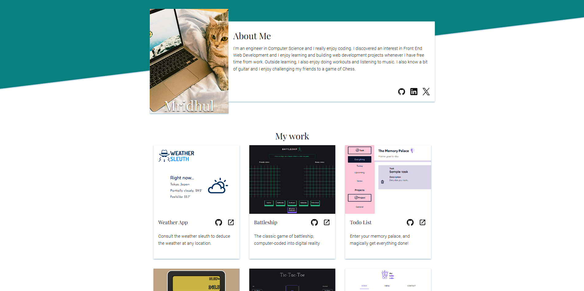
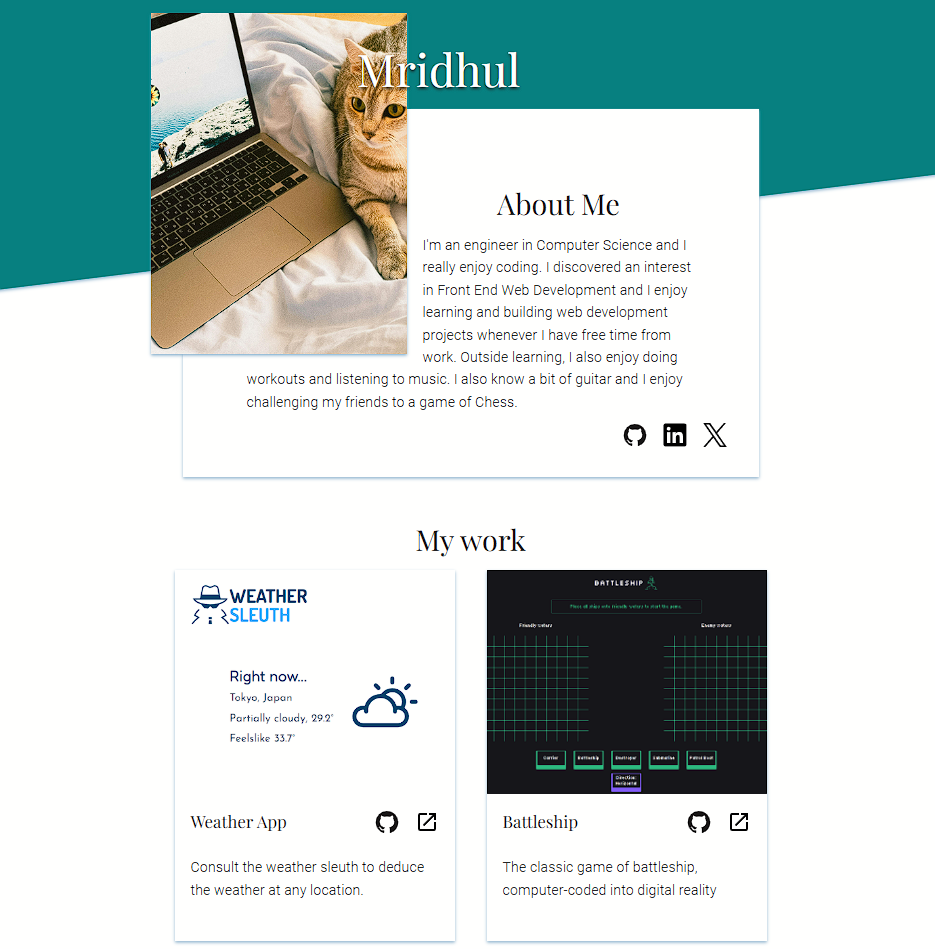
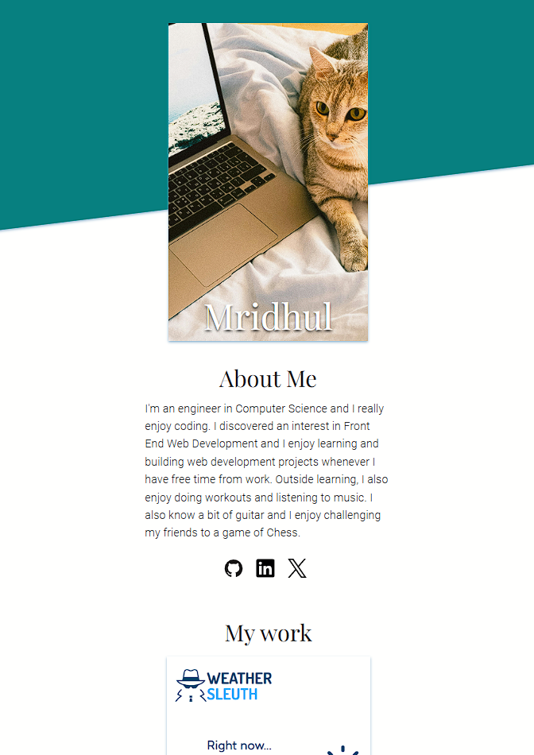

# Homepage

This is my personal homepage (just a practise version), designed using HTML and CSS to achieve responsive and accessible design on any screen

Check it out :point_right:[here!](https://mell62.github.io/homepage/):point_left:

## :tada: Achievements

- **Responsive design** achieved for screens ranging from desktops and tablets to mobiles
- **Natural responsiveness** of **Flexbox** has been utilized
- **Media queries** have been implemented to solidify responsive design
- **Accessibility** friendly design has been implemented, through usage of accessible colors consisting of good contrast ratio, ensuring keyboard navigation, utilizing **WAI-ARIA** to enhance screen reader experience

## :page_with_curl: Note

- Modern normalize is used for cross-browser consistency
